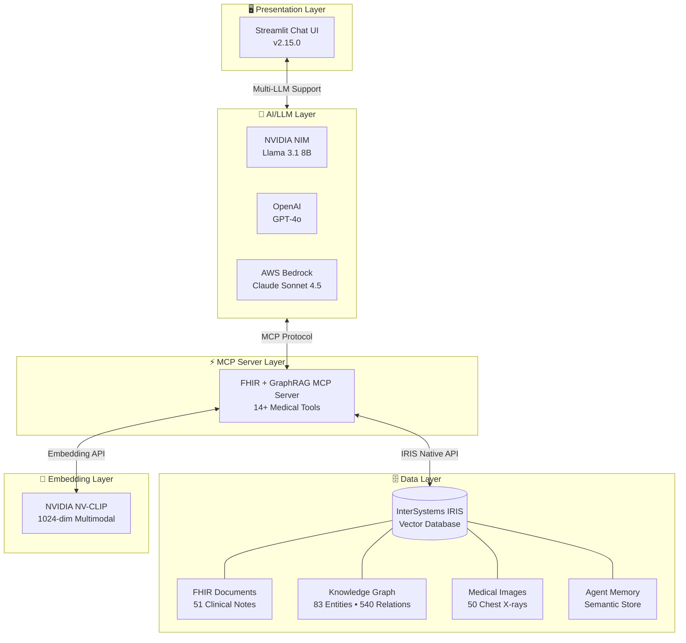
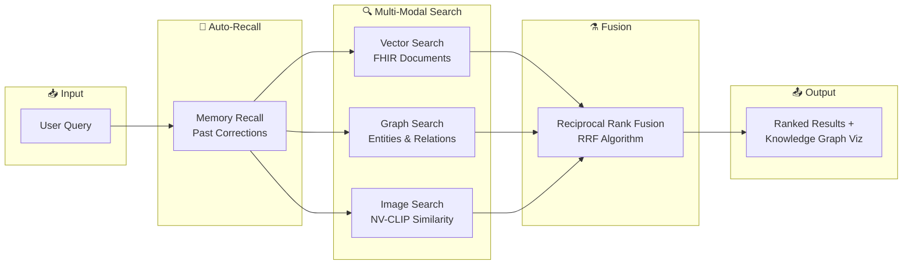
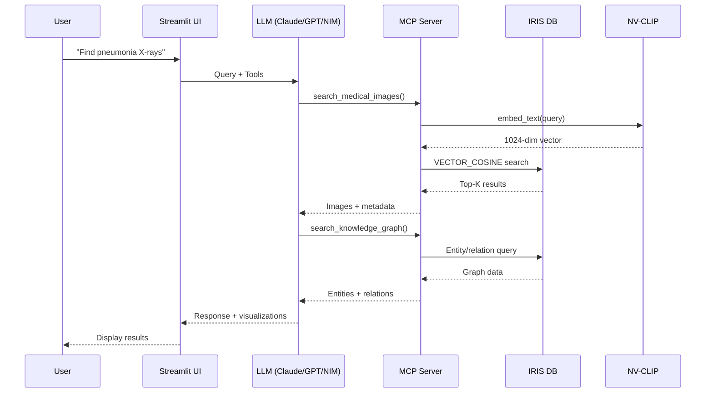
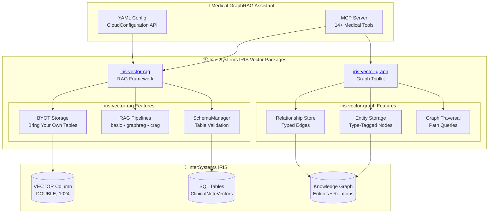
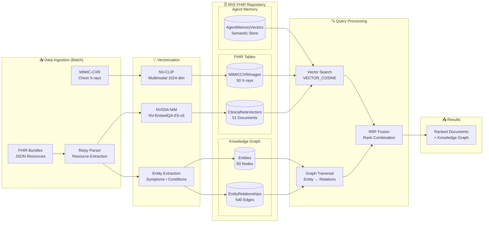
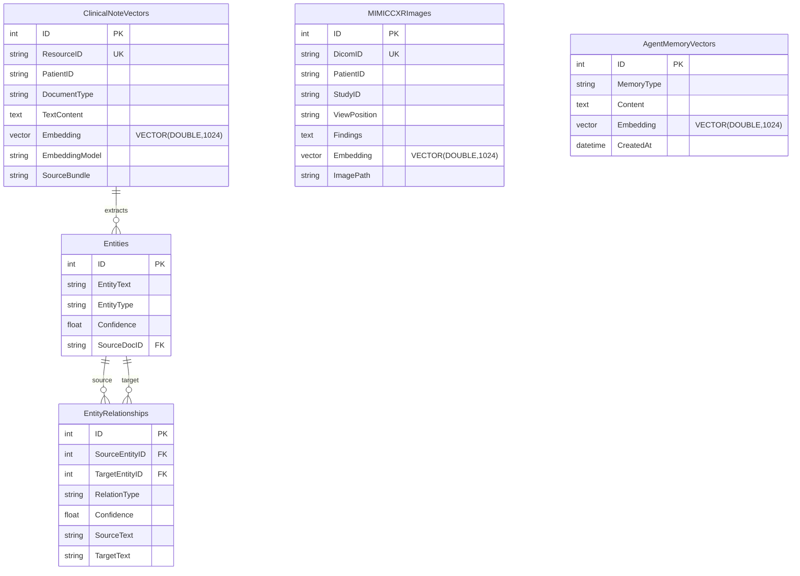

# Medical GraphRAG Assistant

A production-ready medical AI assistant platform built on Model Context Protocol (MCP), featuring GraphRAG multi-modal search, FHIR integration, NVIDIA NIM embeddings, and AWS Bedrock Claude Sonnet 4.5.

**Originally forked from**: [FHIR-AI-Hackathon-Kit](https://github.com/gabriel-ing/FHIR-AI-Hackathon-Kit)

**Current Version**: v2.14.0 (Auto Memory Recall & Interactive Graphs)

## What This Is

An **agentic medical chat platform** with advanced capabilities:
- 🤖 **Model Context Protocol (MCP)** - Claude autonomously calls medical search tools
- 🧠 **GraphRAG** - Knowledge graph-based retrieval with entity and relationship extraction
- 🖼️ **Medical Image Search** - Semantic search over chest X-rays using NV-CLIP embeddings
- 💾 **Agent Memory System** - Persistent semantic memory with vector search
- 🏥 **FHIR Integration** - Full-text search of clinical documents
- ☁️ **AWS Deployment** - Production deployment on AWS EC2 with NVIDIA A10G GPU
- 📊 **Interactive UI** - Streamlit interface with execution transparency
- 🗄️ **InterSystems IRIS** - Vector database with native VECTOR(DOUBLE, 1024) support

## Quick Start

### 1. Run the Streamlit Chat Interface

```bash
# Install dependencies
pip install -r requirements.txt

# Set AWS credentials
export AWS_PROFILE=your-profile

# Configure NV-CLIP endpoint (for medical images and memory)
export NVCLIP_BASE_URL="http://localhost:8002/v1"  # Local NIM via SSH tunnel

# Run the chat app
cd mcp-server
streamlit run streamlit_app.py
```

Visit http://localhost:8501 and start chatting!

### 2. Use as MCP Server (Claude Desktop, etc.)

```bash
# Configure MCP client to point to:
python mcp-server/fhir_graphrag_mcp_server.py
```

## Architecture

### System Overview



### GraphRAG Data Flow



### Component Interaction



### IRIS Vector Package Architecture

This project uses the **InterSystems IRIS Vector** ecosystem:



**Package Links:**
- [`iris-vector-rag`](https://pypi.org/project/iris-vector-rag/) - Production RAG framework with multiple pipelines (basic, graphrag, crag, multi_query_rrf)
- [`iris-vector-graph`](https://pypi.org/project/iris-vector-graph/) - Graph-oriented vector toolkit for GraphRAG workloads

### Data Pipeline: Ingestion → Storage → Query

> **Note:** Current implementation uses **batch vectorization** on initial data load. Vectors are stored in standard VECTOR columns and require manual re-vectorization when source documents change. See [Future Enhancements](#future-enhancements) for planned automatic sync capabilities.



### IRIS Database Schema



## Features

### MCP Tools (10+ available)

**FHIR & GraphRAG:**
1. **search_fhir_documents** - Full-text search of clinical notes
2. **get_document_details** - Retrieve complete clinical notes by ID
3. **search_knowledge_graph** - Search medical entities (symptoms, conditions, medications)
4. **hybrid_search** - Combined vector + graph search with RRF fusion
5. **get_entity_statistics** - Knowledge graph statistics and insights

**Medical Images:**
6. **search_medical_images** - Semantic search over chest X-rays with NV-CLIP

**Agent Memory:**
7. **remember_information** - Store semantic memories (corrections, knowledge, preferences, feedback)
8. **recall_information** - Semantic search over agent memories
9. **get_memory_stats** - Memory system statistics

**Visualizations:**
10. **plot_symptom_frequency** - Chart of most common symptoms
11. **plot_entity_distribution** - Entity type distribution charts
12. **plot_patient_timeline** - Patient encounter timeline
13. **plot_entity_network** - Knowledge graph relationship visualization
14. **visualize_graphrag_results** - Interactive GraphRAG search results

### Chat Interface Features

- ✅ **Multi-Modal Search** - Search clinical text, medical images, and knowledge graph
- ✅ **Agent Memory** - Persistent semantic memory with vector search
- ✅ **Medical Image Display** - View chest X-rays with DICOM support
- ✅ **Execution Transparency** - See which tools Claude calls and its reasoning
- ✅ **Interactive Charts** - Generate visualizations from data
- ✅ **Conversation History** - Multi-turn conversations with context
- ✅ **Memory Editor** - Browse, search, add, and delete agent memories in sidebar
- ✅ **Error Handling** - Graceful handling of API issues with detailed logs
- ✅ **Max Iterations Control** - Prevents infinite loops (10 iteration limit)

### Current Version: v2.14.0

**Recent Features (v2.14.0):**
- ✅ **Auto Memory Recall**: Memories automatically recalled before each query to guide tool selection
- ✅ **Interactive Graph Viz**: Force-directed, draggable graphs with `streamlit-agraph`
- ✅ **Memory in Execution Log**: See recalled memories in "Show Execution Details" pane
- ✅ NetworkX-powered graph layouts with physics simulation

**Previous Updates:**
- v2.13.0: Multi-LLM provider support (NIM > OpenAI > Bedrock), OneDrive backup
- v2.12.0: Agent memory system with pure IRIS vector storage
- v2.10.2: Fixed content processing errors, increased max iterations
- v2.10.0: GraphRAG multi-modal search with RRF fusion
- v2.0.0: AWS deployment with NVIDIA NIM integration

## Configuration

### Required Environment Variables

```bash
# AWS Credentials
export AWS_PROFILE=your-profile  # or set AWS_ACCESS_KEY_ID, AWS_SECRET_ACCESS_KEY

# IRIS Database (AWS Production)
export IRIS_HOST=3.84.250.46  # Your AWS EC2 IP
export IRIS_PORT=1972
export IRIS_NAMESPACE=%SYS  # Use %SYS for AWS deployment
export IRIS_USERNAME=_SYSTEM
export IRIS_PASSWORD=your-password

# NVIDIA NV-CLIP (for medical images and memory)
export NVCLIP_BASE_URL="http://localhost:8002/v1"  # Local NIM via SSH tunnel
# or use cloud API:
# export NVCLIP_BASE_URL="https://integrate.api.nvidia.com/v1"
# export NVIDIA_API_KEY="your-api-key"
```

### Config Files

- `config/fhir_graphrag_config.yaml` - Local development config
- `config/fhir_graphrag_config.aws.yaml` - **AWS production config (active)**
- `config/aws-config.yaml` - AWS infrastructure settings

## Project Structure

```
medical-graphrag-assistant/
├── mcp-server/                      # MCP server and Streamlit app
│   ├── fhir_graphrag_mcp_server.py  # MCP server with 10+ tools
│   ├── streamlit_app.py             # Chat UI v2.12.0 with memory editor
│   └── test_*.py                    # Integration tests
├── src/
│   ├── db/                          # IRIS database clients
│   ├── embeddings/                  # NVIDIA NIM integration
│   │   └── nvclip_embeddings.py     # NV-CLIP multimodal embeddings
│   ├── memory/                      # Agent memory system
│   │   └── vector_memory.py         # Semantic memory with IRIS vectors
│   ├── search/                      # Search implementations
│   ├── vectorization/               # Document vectorization
│   └── validation/                  # Data validation
├── config/                          # Configuration files
│   └── fhir_graphrag_config.aws.yaml  # Active AWS config
├── docs/                            # Documentation
│   ├── architecture.md              # System architecture
│   ├── deployment-guide.md          # AWS deployment
│   └── troubleshooting.md           # Common issues
├── scripts/                         # Deployment and utility scripts
│   └── aws/                         # AWS-specific scripts
├── tests/                           # Test suite
└── archive/                         # Historical implementations and docs
```

## Technology Stack

**AI/ML:**
- AWS Bedrock (Claude Sonnet 4.5)
- NVIDIA NV-CLIP (1024-dim multimodal embeddings)
- NVIDIA NIM (Inference Microservices)
- Model Context Protocol (MCP)

**Database & Vector Storage:**
- InterSystems IRIS Community Edition (AWS EC2)
- Native VECTOR(DOUBLE, 1024) support
- VECTOR_COSINE similarity search
- Tables: ClinicalNoteVectors, MIMICCXRImages, Entities, EntityRelationships, AgentMemoryVectors

**InterSystems IRIS Vector Packages:**
- [`iris-vector-rag`](https://pypi.org/project/iris-vector-rag/) - Production RAG framework with BYOT storage, GraphRAG pipelines, and CloudConfiguration API
- [`iris-vector-graph`](https://pypi.org/project/iris-vector-graph/) - Graph-oriented vector toolkit for entity storage and relationship traversal
- `intersystems-irispython` - Native IRIS database driver

**Infrastructure:**
- AWS EC2 g5.xlarge (NVIDIA A10G GPU)
- Python 3.10+
- Streamlit for UI
- Docker for containerization

**Key Libraries:**
- `fhirpy` - FHIR resource parsing and handling
- `boto3` - AWS SDK
- `streamlit` - Chat UI
- `streamlit-agraph` - Interactive graph visualization
- `mcp` - Model Context Protocol SDK
- `pydicom` - DICOM medical image processing
- `networkx` - Graph algorithms and layout

## Example Queries

Try these in the chat interface:

**FHIR Search:**
- "Find patients with chest pain"
- "Search for diabetes cases"
- "Show recent emergency visits"

**GraphRAG:**
- "What medications treat hypertension?"
- "Show me the relationship between conditions and procedures"
- "What are the side effects of metformin?"

**Medical Images:**
- "Show me chest X-rays of pneumonia"
- "Find chest X-rays showing cardiomegaly"
- "Search for lateral view chest X-rays"

**Agent Memory:**
- "Remember that I prefer concise clinical summaries"
- "What do you know about my preferences?"
- "Recall any corrections I've given you about medical terminology"

**Hybrid Search:**
- "Find treatment options for chronic pain" (combines vector + graph + image search)

**Visualization:**
- "Show a chart of conditions by frequency"
- "Visualize the knowledge graph for chest pain"
- "Graph the entity relationships"

## Backup

The project uses OneDrive for automatic cloud backup:

```bash
# Run backup (rsync to OneDrive folder)
./scripts/backup-to-onedrive.sh
```

Backup includes all code, configs, and medical images (~195 MB). OneDrive automatically syncs to cloud.

## Development

### Running Tests

```bash
# Unit tests
pytest tests/unit/

# Integration tests
pytest tests/integration/

# E2E tests
pytest tests/e2e/
```

### Debug Mode

Enable debug logging:

```python
import logging
logging.basicConfig(level=logging.DEBUG)
```

### AWS Deployment

The system is deployed on AWS EC2 with:
- **Instance**: g5.xlarge (NVIDIA A10G GPU)
- **Region**: us-east-1
- **Database**: InterSystems IRIS Community Edition
- **GPU Services**: NVIDIA NIM for NV-CLIP embeddings
- **Data**: 50 medical images, 51 clinical notes, 83 entities, 540 relationships

See [docs/deployment-guide.md](docs/deployment-guide.md) for detailed deployment instructions.

## Troubleshooting

See [docs/troubleshooting.md](docs/troubleshooting.md) for common issues.

**Common Issues:**
- AWS credentials not configured → Set AWS_PROFILE or AWS env vars
- IRIS connection failed → Check IRIS_HOST and credentials
- NV-CLIP not responding → Check NVCLIP_BASE_URL and SSH tunnel
- Medical images not found → Verify image paths and DICOM support
- Memory search returning 0 results → Check embeddings with magnitude test
- Max iterations reached → Query may be too complex, try simplifying

## Documentation

### Core Documentation
- [Architecture Overview](docs/architecture.md) - System design and data flow
- [Deployment Guide](docs/deployment-guide.md) - AWS deployment instructions
- [Troubleshooting Guide](docs/troubleshooting.md) - Common issues and solutions

### Current Session Docs
- [EMBEDDINGS_FIXED.md](EMBEDDINGS_FIXED.md) - Image and memory embeddings fix
- [MEMORY_SEARCH_BROWSE_FIX.md](MEMORY_SEARCH_BROWSE_FIX.md) - Memory search UI fix
- [PROGRESS.md](PROGRESS.md) - Development history and achievements
- [TODO.md](TODO.md) - Current tasks and roadmap

### Historical Documentation
- [archive/](archive/) - Old implementations, scripts, and session docs

## Future Enhancements

### Automatic Vector Synchronization

**Current State:** Vectors are generated via batch processing during initial data load. When FHIR documents are updated in the repository, embeddings must be manually re-generated.

**Planned Enhancement:** Leverage IRIS EMBEDDING column type for automatic vector synchronization:

```sql
-- Future: Auto-computed embeddings on INSERT/UPDATE
CREATE TABLE ClinicalNoteVectors (
    ID INT PRIMARY KEY,
    TextContent TEXT,
    Embedding EMBEDDING[MODEL='NV-EmbedQA-E5-v5'](TextContent)  -- Auto-computed
);
```

**Benefits:**
- Automatic re-vectorization when `TextContent` changes
- No manual batch re-processing required
- Real-time sync between FHIR repository and vector store

### Additional Planned Features

- **FHIR Subscription Hooks** - Trigger vectorization on resource create/update events
- **Incremental Knowledge Graph Updates** - Update entities/relationships without full rebuild
- **IRIS HealthShare Integration** - Direct FHIR R4 repository connection
- **Vector Index Optimization** - HNSW index tuning for larger datasets
- **Multi-tenant Support** - Namespace isolation for multiple healthcare organizations

## Contributing

This project is based on the FHIR-AI-Hackathon-Kit. The original tutorial content remains in the `tutorial/` directory.

## License

Inherits license from upstream FHIR-AI-Hackathon-Kit repository.

## Acknowledgments

- **Original Project**: [FHIR-AI-Hackathon-Kit](https://github.com/gabriel-ing/FHIR-AI-Hackathon-Kit) by gabriel-ing
- **InterSystems IRIS** for the vector database platform
- **AWS Bedrock** for Claude Sonnet 4.5 access
- **NVIDIA NIM** for NV-CLIP multimodal embeddings
- **Model Context Protocol** by Anthropic
- **MIMIC-CXR** dataset for medical imaging data
