# Agent Memory System

The Medical GraphRAG Assistant includes a persistent semantic memory system that allows the AI agent to learn and remember information across conversations. This document provides comprehensive documentation of the memory architecture, implementation, and usage.

## Overview

The Agent Memory system provides:
- **Semantic storage** of corrections, preferences, and learned knowledge
- **Vector-based recall** using NV-CLIP 1024-dimensional embeddings
- **Auto-recall** before each query to guide tool selection
- **Type-based organization** of memories (correction, preference, knowledge, feedback)
- **UI management** via sidebar memory editor

## Architecture

```mermaid
flowchart TB
    subgraph UI["🖥️ Streamlit UI"]
        CHAT[Chat Interface]
        MEM_EDITOR[Memory Editor<br/>Sidebar Panel]
    end

    subgraph AGENT["🤖 Agent Layer"]
        LLM[LLM<br/>Claude/GPT/NIM]
        AUTO[Auto-Recall<br/>Pre-Query Hook]
    end

    subgraph MCP["⚡ MCP Tools"]
        REMEMBER[remember_information<br/>Store new memory]
        RECALL[recall_information<br/>Semantic search]
        STATS[get_memory_stats<br/>Statistics]
    end

    subgraph STORAGE["🗄️ Vector Memory"]
        VM[VectorMemory Class]
        IRIS[(IRIS Database<br/>AgentMemoryVectors)]
        NVCLIP[NV-CLIP<br/>1024-dim Embeddings]
    end

    CHAT --> LLM
    MEM_EDITOR --> VM
    LLM --> AUTO
    AUTO --> RECALL
    LLM --> MCP
    MCP --> VM
    VM --> IRIS
    VM --> NVCLIP
```



## Database Schema

Memories are stored in the `SQLUser.AgentMemoryVectors` table:

```sql
CREATE TABLE SQLUser.AgentMemoryVectors (
    MemoryID VARCHAR(255) PRIMARY KEY,      -- UUID identifier
    MemoryType VARCHAR(50) NOT NULL,        -- correction | preference | knowledge | feedback
    MemoryText VARCHAR(4000) NOT NULL,      -- The memory content
    Embedding VECTOR(DOUBLE, 1024),         -- NV-CLIP embedding
    Metadata VARCHAR(4000),                 -- JSON metadata (source, timestamp, etc.)
    UseCount INT DEFAULT 1,                 -- Times recalled
    CreatedAt TIMESTAMP DEFAULT CURRENT_TIMESTAMP,
    UpdatedAt TIMESTAMP DEFAULT CURRENT_TIMESTAMP
)
```

### Memory Types

| Type | Description | Example |
|------|-------------|---------|
| `correction` | Factual corrections from user | "Metformin is for diabetes, not hypertension" |
| `preference` | User preferences for output | "I prefer concise clinical summaries" |
| `knowledge` | Learned medical knowledge | "This hospital uses ICD-10-CM codes" |
| `feedback` | User feedback on responses | "The last response was too verbose" |

## Core Components

### 1. VectorMemory Class

Located at `src/memory/vector_memory.py`, this class handles all memory operations:

```python
class VectorMemory:
    """Pure IRIS vector-based semantic memory storage."""

    def __init__(
        self,
        iris_host: str = "localhost",
        iris_port: int = 1972,
        iris_namespace: str = "%SYS",
        iris_username: str = "_SYSTEM",
        iris_password: str = "ISCDEMO",
        nvclip_base_url: str = None,
        table_name: str = "SQLUser.AgentMemoryVectors"
    ):
        ...
```

**Key Methods:**

| Method | Description |
|--------|-------------|
| `store(text, memory_type, metadata)` | Store a new memory with embedding |
| `recall(query, limit, memory_type)` | Semantic search over memories |
| `list_all(memory_type, limit)` | List memories without search |
| `delete(memory_id)` | Delete a specific memory |
| `get_stats()` | Get memory statistics by type |

### 2. MCP Memory Tools

Three memory tools are exposed via the MCP server:

#### `remember_information`
Store new information in agent memory.

```python
@mcp.tool()
async def remember_information(
    content: str,              # What to remember
    memory_type: str = "knowledge",  # correction | preference | knowledge | feedback
    tool_name: str = None      # Required for corrections
) -> str:
```

**Usage Examples:**
- "Remember that I prefer brief responses" → `preference`
- "Remember: metformin treats diabetes" → `knowledge`
- "That's wrong, search_knowledge_graph should use..." → `correction`

#### `recall_information`
Semantic search over stored memories.

```python
@mcp.tool()
async def recall_information(
    query: str,           # Search query
    limit: int = 5,       # Max results
    memory_type: str = None  # Filter by type
) -> str:
```

**Returns:** List of relevant memories with similarity scores.

#### `get_memory_stats`
Get statistics about stored memories.

```python
@mcp.tool()
async def get_memory_stats() -> str:
```

**Returns:** Memory counts by type, total count, storage info.

### 3. Auto-Recall System

Before each user query, the system automatically recalls relevant memories:

```python
def _auto_recall_memories(self, query: str) -> str:
    """Recall relevant memories to prepend to system prompt."""
    if not self.memory:
        return ""

    try:
        memories = self.memory.recall(query, limit=3)
        if not memories:
            return ""

        memory_context = "\n## Recalled Memories (Auto)\n"
        for mem in memories:
            memory_context += f"- [{mem['type']}] {mem['text']}\n"

        return memory_context
    except Exception as e:
        return ""
```

This allows corrections and preferences to automatically influence tool selection and response generation.

## Data Flow

### Storing a Memory


### Recalling Memories


## Embedding Strategy

The system uses **NV-CLIP** for memory embeddings:

| Property | Value |
|----------|-------|
| Model | `nvidia/nvclip` |
| Dimension | 1024 |
| Similarity | Cosine (VECTOR_COSINE) |
| Storage | IRIS VECTOR(DOUBLE, 1024) |

**Why NV-CLIP?**
- Multimodal compatibility (same model used for images)
- High-quality semantic representations
- Fast inference via NVIDIA NIM

### Embedding Generation

```python
def _get_embedding(self, text: str) -> List[float]:
    """Get NV-CLIP text embedding."""
    response = requests.post(
        f"{self.nvclip_base_url}/embeddings",
        json={
            "input": text,
            "model": "nvidia/nvclip",
            "input_type": "text"
        },
        headers={"Content-Type": "application/json"},
        timeout=30
    )
    return response.json()["data"][0]["embedding"]
```

## UI Integration

### Memory Editor (Sidebar)

The Streamlit sidebar includes a Memory Editor panel:

```python
with st.sidebar.expander("💾 Memory Editor", expanded=False):
    # Search memories
    search_query = st.text_input("Search memories")

    # Add new memory
    with st.form("add_memory"):
        new_memory = st.text_area("New memory")
        memory_type = st.selectbox("Type", ["preference", "knowledge", "correction", "feedback"])
        submit = st.form_submit_button("Add Memory")

    # Display existing memories
    memories = memory.list_all(limit=20)
    for mem in memories:
        col1, col2 = st.columns([4, 1])
        with col1:
            st.markdown(f"**[{mem['type']}]** {mem['text'][:100]}...")
        with col2:
            if st.button("🗑️", key=mem['id']):
                memory.delete(mem['id'])
```

### Execution Details Integration

Recalled memories appear in the "Show Execution Details" panel:

```python
with st.expander("Show Execution Details"):
    # Memories section
    if recalled_memories:
        st.markdown("### 🧠 Recalled Memories")
        for mem in recalled_memories:
            st.markdown(f"- **[{mem['type']}]** {mem['text']}")
```

## Configuration

### Environment Variables

```bash
# IRIS Database (for memory storage)
export IRIS_HOST=localhost
export IRIS_PORT=1972
export IRIS_NAMESPACE=%SYS
export IRIS_USERNAME=_SYSTEM
export IRIS_PASSWORD=your-password

# NV-CLIP (for embeddings)
export NVCLIP_BASE_URL="http://localhost:8002/v1"
```

### YAML Configuration

In `config/fhir_graphrag_config.aws.yaml`:

```yaml
memory:
  enabled: true
  table_name: "SQLUser.AgentMemoryVectors"
  auto_recall: true
  auto_recall_limit: 3
  embedding_model: "nvidia/nvclip"
```

## Example Usage

### Via Chat Interface

**Storing a correction:**
```
User: That's wrong - you should use search_fhir_documents for clinical notes, not hybrid_search

Agent: I'll remember that correction about using search_fhir_documents for clinical notes.
[Internally calls remember_information with memory_type="correction"]
```

**Storing a preference:**
```
User: Remember that I prefer bullet-point summaries

Agent: Got it! I'll remember your preference for bullet-point summaries.
[Stores preference in memory]
```

**Automatic recall in action:**
```
User: Find patients with chest pain

[Auto-recall retrieves relevant memories before processing]
[If previous correction said "use search_fhir_documents for symptoms",
 the agent will prefer that tool]

Agent: [Uses search_fhir_documents based on recalled correction]
```

### Via Python API

```python
from src.memory.vector_memory import VectorMemory

# Initialize
memory = VectorMemory(
    iris_host="localhost",
    nvclip_base_url="http://localhost:8002/v1"
)

# Store a memory
memory_id = memory.store(
    text="Patient prefers metric units for lab values",
    memory_type="preference",
    metadata={"source": "user_input", "patient_id": "123"}
)

# Recall relevant memories
results = memory.recall(
    query="lab results format",
    limit=5,
    memory_type="preference"
)

# Get statistics
stats = memory.get_stats()
print(f"Total memories: {stats['total']}")
print(f"Corrections: {stats['by_type']['correction']}")
```

## Similarity Search

The recall function uses IRIS vector cosine similarity:

```sql
SELECT TOP ?
    MemoryID, MemoryType, MemoryText, Metadata, UseCount, CreatedAt
FROM SQLUser.AgentMemoryVectors
WHERE MemoryType = ?  -- Optional filter
ORDER BY VECTOR_COSINE(Embedding, TO_VECTOR(?)) DESC
```

### Similarity Thresholds

| Score | Interpretation |
|-------|----------------|
| > 0.85 | High relevance |
| 0.70 - 0.85 | Moderate relevance |
| 0.50 - 0.70 | Low relevance |
| < 0.50 | Likely irrelevant |

## Troubleshooting

### Common Issues

**1. Memory search returns 0 results**
- Check that NV-CLIP is running and accessible
- Verify NVCLIP_BASE_URL environment variable
- Test embedding generation independently

**2. Memories not persisting**
- Verify IRIS connection settings
- Check table exists: `SELECT * FROM SQLUser.AgentMemoryVectors`
- Ensure write permissions on IRIS namespace

**3. Auto-recall not working**
- Confirm `auto_recall: true` in config
- Check Streamlit logs for recall errors
- Verify memory table has records

### Debugging

Enable debug logging:

```python
import logging
logging.getLogger('src.memory').setLevel(logging.DEBUG)
```

Check memory table directly:

```sql
-- Count memories by type
SELECT MemoryType, COUNT(*) as cnt
FROM SQLUser.AgentMemoryVectors
GROUP BY MemoryType;

-- Recent memories
SELECT TOP 10 MemoryID, MemoryType, MemoryText, CreatedAt
FROM SQLUser.AgentMemoryVectors
ORDER BY CreatedAt DESC;
```

## Future Enhancements

- **Memory decay**: Reduce relevance of old, unused memories
- **Memory consolidation**: Merge similar memories
- **Memory export/import**: Backup and restore memory state
- **Multi-user support**: Isolated memory per user session
- **Memory visualization**: Graph view of memory relationships

## Related Documentation

- [Architecture Overview](architecture.md)
- [MCP Tools Reference](../README.md#mcp-tools-architecture)
- [Troubleshooting Guide](troubleshooting.md)
