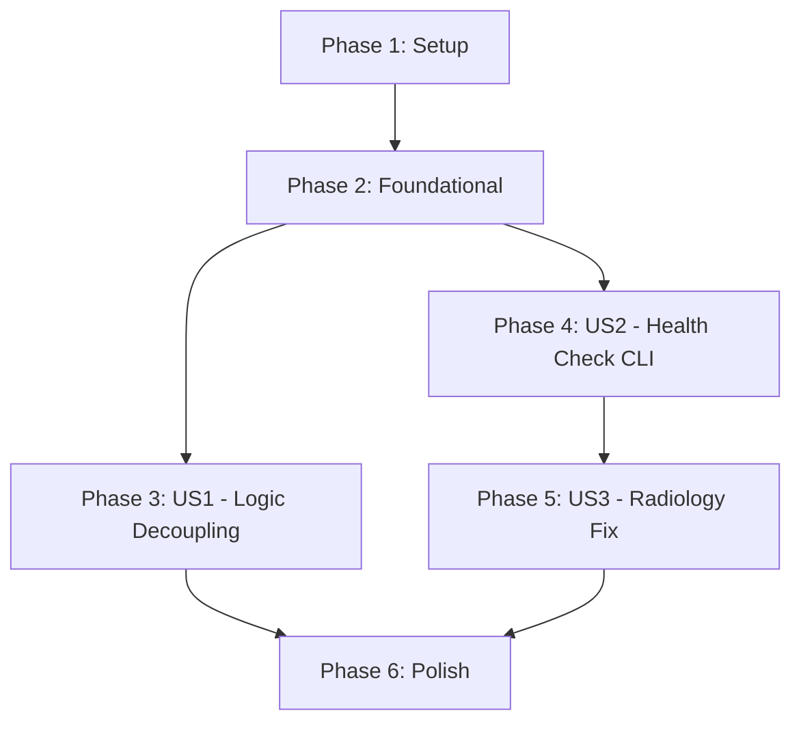

# Tasks: Pragmatic Refactor and Radiology Fix

**Feature Branch**: `010-refactor-radiology-fix` | **Date**: 2026-01-02

## Phase 1: Setup

- [x] T001 Create `src/cli` package and `src/search` service layer structure
- [x] T002 [P] Create `tests/unit/search` directory for service layer unit tests

## Phase 2: Foundational

- [x] T003 [P] Move and refactor `src/query/fhir_graphrag_query.py` into foundational service components in `src/search/`
- [x] T004 Implement parameterized SQL helper in `src/search/utils.py` to ensure constitution compliance (Principle I)

## Phase 3: User Story 1 - Logic Decoupling [US1]

**Goal**: Extract core search logic from MCP server into service layer for testability.
**Independent Test**: `pytest tests/unit/search/test_hybrid_search.py` passes without running MCP server.

- [x] T005 [P] [US1] Implement `src/search/fhir_search.py` ensuring all SQL uses the parameterized helper from `src/search/utils.py` (Principle I)
- [x] T006 [P] [US1] Implement `src/search/kg_search.py` ensuring all SQL uses the parameterized helper from `src/search/utils.py` (Principle I)
- [x] T007 [US1] Implement `src/search/hybrid_search.py` ensuring RRF fusion logic uses parameterized queries for sub-searches (Principle I)
- [x] T008 [US1] Create unit tests in `tests/unit/search/test_hybrid_search.py` verifying search results
- [x] T008a [US1] Implement `tests/unit/mcp/test_tool_wrappers.py` to verify the main tool handler logic using mocked service calls (FR-004)
- [x] T009 [US1] Refactor `mcp-server/fhir_graphrag_mcp_server.py` to delegate `search_fhir_documents`, `search_knowledge_graph`, and `hybrid_search` to the new service layer
- [x] T010 [US1] Verify MCP tools still work using `python mcp-server/test_mcp_tool_execution.py`

## Phase 4: User Story 2 - System Health & Smoke Test CLI [US2]

**Goal**: Implement CLI tool to verify database connectivity and schema integrity.
**Independent Test**: `python -m src.cli check-health` returns a passing report on local/EC2.

- [x] T011 [P] [US2] Extend `src/validation/health_checks.py` with `iris_schema_check()` to verify required tables
- [x] T012 [US2] Implement CLI entry point in `src/cli/__main__.py` including graceful error handling for AWS SSO expiration/connectivity failures
- [x] T013 [US2] Add smoke test mode to CLI that performs a minimal search using the service layer
- [x] T014 [US2] Create integration test `tests/integration/test_cli.py` for the health check command
- [x] T014a [US2] Verify CLI latency: `time python -m src.cli check-health` must complete in under 3 seconds (SC-002)

## Phase 5: User Story 3 - Radiology Integration Stability [US3]

**Goal**: Ensure radiology tools work reliably on EC2 and fix missing table issue.
**Independent Test**: `pytest tests/ux/playwright/test_radiology.py` passes on EC2.

- [x] T015 [US3] Ensure `src/setup/create_text_vector_table.py` is robust and creates `SQLUser.FHIRDocuments` correctly
- [x] T016 [US3] Add a "Fix Environment" command to the CLI that runs missing setup scripts
- [x] T017 [US3] Run full Playwright radiology suite on EC2 IP `13.218.19.254` and verify all tests pass
- [x] T018 [US3] Update `AGENTS.md` and `PROGRESS.md` with verified system stability status

## Phase 6: Polish & Cross-Cutting

- [x] T019 [P] Run `ruff check . --fix` across all modified files
- [x] T020 Run `lsp_diagnostics` on `fhir_graphrag_mcp_server.py` to ensure refactor didn't introduce regressions

## Dependency Graph

## Parallel Execution Examples

### Parallel Unit Work (US1 & US2)
- **Developer A**: T005, T006, T007 (Implementing search services)
- **Developer B**: T011, T012 (Implementing Health Check CLI)
- *Total time reduced by overlapping service implementation with CLI development.*

## Implementation Strategy
1. **MVP**: Complete US1 and US2 first. This provides the decoupling and the verification tools needed for stable development.
2. **Incremental**: Use the new CLI `check-health` to verify the EC2 environment before attempting the US3 Radiology fix.
3. **Verification**: Always run unit tests for services before testing the MCP server integration.
